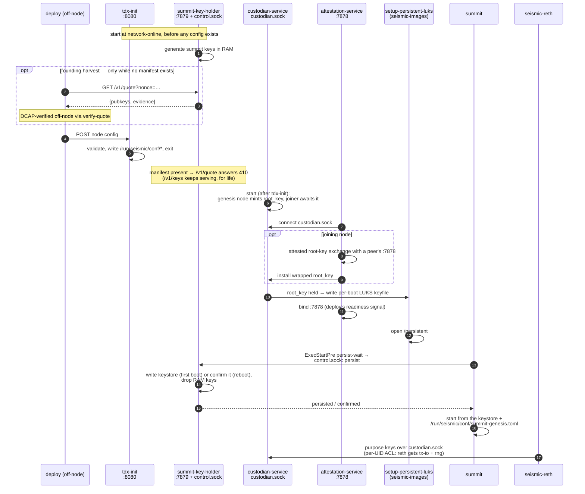
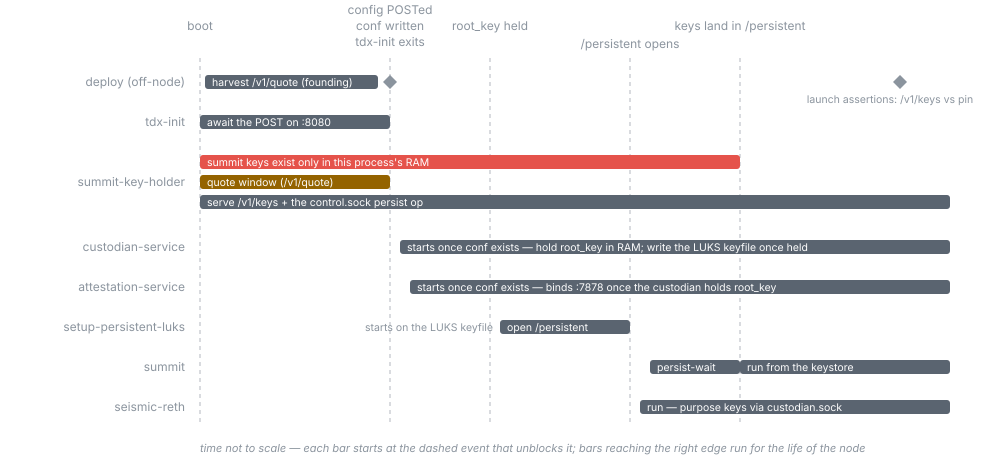

# Seismic enclave

The processes that run inside a Seismic node's TEE: they custody the network
root key, attest the node to peers and clients, and hand the node its runtime
configuration at boot.

## Layout

`bin/` holds the four deployed binaries plus `verify-quote`, which runs
off-node in deploy's hands; every crate under `crates/` is a library they
share.

### Binaries (`bin/`)

| Crate (dir) | Binary | Role |
|---|---|---|
| `tdx-init` | `tdx-init` | Boot-time init: receives node config over HTTP and writes the enclave/reth runtime env, then exits. |
| `attestation-service` | `seismic-attestation-service` | Network-facing JSON-RPC service (`:7878`): serves attestation evidence and purpose keys. Holds no key material — reaches the custodian over a Unix socket. |
| `custodian-service` | `seismic-custodian-service` | Standalone service for the RAM-only root-key custodian: no network listener, minimal Unix-socket API, owns the per-boot LUKS keyfile handoff. |
| `summit-key-holder` | `summit-key-holder` | Pre-manifest holder of a node's summit consensus keys: generates them in RAM at boot, serves `{pubkeys, quote}` over HTTP (`:7879`) for deploy's founding harvest, persists them into summit's keystore once LUKS opens. |
| `verify-quote` | `verify-quote` | Not deployed to nodes: operator relying-party CLI that DCAP-verifies node quotes against a measurement policy (JSON on stdout, exit 0 ⇔ verified). One verification path, two evidence sources: `harvest` checks a founding node's summit-keys quote supplied as a file, `deploy` challenges a freshly provisioned node's `getDeployVerificationEvidence` RPC itself. Shelled out to by deploy's tooling. |

### Libraries (`crates/`)

| Crate | What it is |
|---|---|
| `enclave` | Shared enclave API types (JSON-RPC surface); imported by seismic-reth. |
| `crypto` | AES-GCM / ECDH / HKDF helpers shared across the Seismic stack. |
| `custodian` | RAM-only custodian of the network root key. |
| `custodian-ipc` | Wire protocol, client, and server for the custodian Unix socket (plus a debug CLI behind the `cli` feature). |
| `attestation` | Attestation evidence types and policy checks. |
| `attestation-rpc` | Purpose-specific attestation JSON-RPC types. |
| `measurement-admission` | Admission-ID derivation and measurement-policy compiler for the on-chain `MeasurementRegistry` (plus the policy-compiler CLI behind the `cli` feature). |
| `network-manifest` | Network-manifest schema (`NetworkManifestV1`) and `network_id` derivation. |
| `measurement-registry-client` | Read-only Alloy client for the on-chain `MeasurementRegistry`. |

## Boot chain

How the deployed binaries relate across one node boot. Every boot runs
the same sequence; the founding harvest is the only founding-specific
step (see [network-founding.md](https://github.com/SeismicSystems/seismic/blob/main/docs/tee/network-founding.md)).
Unit ordering and the LUKS setup script live in seismic-images; deploy
drives the node from off-box.

The same boot as a timeline — bars are process lifespans, labeled
vertical lines are the boot-chain events. The red bar is the
founding-fragility window: the summit keys exist only in one process's
RAM until `/persistent` exists, and `/persistent` only exists
*downstream of tdx-init's exit* (conf gates the custodian, the
custodian's root_key gates the LUKS keyfile, the keyfile gates the
mount). tdx-init is the only exits-after-boot binary; the holder and
the custodian are both key-custodian services that do their critical
work in the first seconds and then stay up serving it.

## Building

All crates build with `cargo build --workspace`. The custodian and attestation
service link Intel SGX/TDX libraries and only build on a Linux host with those
installed — see [tss-esapi-sys](https://crates.io/crates/tss-esapi-sys).

The custodian and attestation service run as a coordinated pair: the service
acquires the root key from the custodian over the socket at startup, so neither
runs standalone. `scripts/run_integration_tests.sh` exercises the real
topology (a custodian + service pair per node); the deployed systemd units live
in `seismic-images`.
