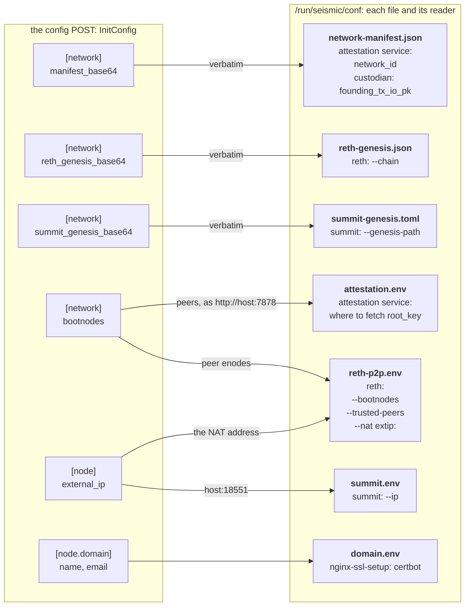

# tdx-init

Small HTTP service that receives node configuration on every boot of a
Seismic TDX VM and translates it into per-service config files under
`/run/seismic/conf/` (tmpfs) for downstream services to consume.

Used by [seismic-images](https://github.com/SeismicSystems/seismic-images)
as part of the TDX VM boot sequence. The conf dir is on tmpfs and
recreated by `systemd-tmpfiles` at sysinit; deploy tooling re-POSTs the
config every boot.

## Usage

```
tdx-init wait-for-config
```

Behavior:

- Starts an HTTP server on port 8080 and waits for the operator to POST
  an `InitConfig` TOML.
- On receipt:
  - validates the schema
  - writes per-service config files under `/run/seismic/conf/`
  - touches the sentinel `/run/seismic/conf/.tdx-init-done`
  - exits
- The sentinel is written last, so its presence means every file is in
  place: the attestation service, up since boot, waits on it.
- On start, it looks for the sentinel:
  - absent: it serves the POST. Every boot starts here, since
    `/run/seismic/conf/` is tmpfs and empty, sentinel included.
  - present: it exits without serving, so a restart within a boot
    (e.g. `systemctl restart`) never takes a second POST.

## InitConfig schema

The HTTP receiver accepts TOML with `Content-Type: application/toml`.
Unknown top-level sections or fields are rejected. The schema is its own
crate, [`tdx-init-config`](../../crates/tdx-init-config), so deploy tooling
constructs the exact struct this binary deserializes.

```toml
[network]                            # coordinator-produced; a function of the network, not of this node
manifest_base64 = "eyJib290c3RyYXBfbWVhc3VyZW1lbn..."
reth_genesis_base64 = "eyJjb25maWciOnsiY2hhaW5JZCI..."
summit_genesis_base64 = "bmFtZXNwYWNlID0gInNlaXNtaWM..."
bootnodes = ["enode://<128 hex pubkey>@host:port"]  # the cohort's peers; [] only on the pinned box at founding

[node]                               # this node only
external_ip = "203.0.113.7"          # this VM's public IP (reth --nat extip:, summit --ip)

[node.domain]
name = "<your.public.dns.name>"      # FQDN clients reach this VM at
email = "<contact@example.com>"      # ACME registration / renewal email
```

### What each field becomes



- **The three `[network]` artifacts are written verbatim**, never parsed and
  re-serialized. `network_id` is the SHA-256 of the manifest's exact bytes, and
  the manifest pins the other two: `eth.genesis_hash` the reth genesis block,
  `summit.genesis_config_digest` the summit genesis. So the three are one
  assembled set, and a manifest paired with a genesis it doesn't pin makes a
  node that can't join its own cohort.
- **`bootnodes` is rendered three ways, never delivered three times.** This
  node's own enode (host == `external_ip`) is dropped, and the remaining peers
  become:
  - reth's `--bootnodes`, which seeds discv5 once per boot; one live bootnode
    is enough for the DHT to find the rest;
  - reth's `--trusted-peers`, the same enodes, which reth dials directly over
    RLPx with retry, so a lost discv5 round-trip costs latency rather than a
    seat in the tx-gossip mesh;
  - the attestation service's root-key fetch list, as `http://<host>:7878`.

  All three name the same machines by construction.
- **`external_ip` is the one address both planes advertise**: reth's
  `--nat extip:` (Azure NICs hold private addresses, so reth's NAT
  autodetection can't be trusted) and summit's consensus address. It is also
  how tdx-init recognizes this node's own enode in `bootnodes`.

### What tdx-init checks at POST time

A failed check answers `400` and writes nothing, so a bad config fails the
deploy rather than a later boot. The shape of `bootnodes`, `external_ip` and
`[node.domain]` is checked while the TOML is parsed, by
[`tdx-init-config`](../../crates/tdx-init-config)'s types, so deploy tooling
building a config runs the same checks.

- **`manifest_base64`**: the strict v1 schema, parsed by
  [`seismic-network-manifest`](../../crates/network-manifest).
- **`reth_genesis_base64`**: valid JSON whose `config.chainId` equals the
  manifest's `eth.chain_id`. The manifest's `eth.genesis_hash` covers the
  genesis block (header, and the alloc through the state root) but not the
  file's `config` section, so the hash commitment is checked deploy-side
  (`src/reth_genesis.rs`).
- **`summit_genesis_base64`**: valid TOML whose `namespace` equals the
  manifest's `summit.namespace`. The manifest pins summit's SSZ
  `config_digest`, which covers the consensus parameters and every
  validator's keys and withdrawal credentials but not its IP. tdx-init can't
  recompute it without reimplementing summit's layout. Deploy checks it
  against the manifest before POSTing, and summit derives its P2P and signing
  domains from it, so a node fed a divergent genesis can't complete a
  handshake (`src/summit_genesis.rs`).
- **`bootnodes`**: each entry is `enode://<128 hex pubkey>@host:port`, with
  the host an IPv4 address, a bracketed IPv6 address or a hostname, so no
  entry can break a line of `reth-p2p.env` or `attestation.env`. At least one
  names a machine other than this one, unless this box holds the pinned
  candidate. tdx-init compares the custodian's candidate tx_io_pk file
  (`/run/seismic/custodian/candidate-tx-io-pk`) with the manifest's
  `founding_tx_io_pk`, so `bootnodes = []` is valid only on the box assemble
  pinned, at founding (`src/peers.rs`).
- **`external_ip`**: an IP address.
- **`[node.domain]`**: `name` is an RFC 1123 hostname (letters, digits and
  `-` in dot-separated labels, at most 253 characters) and `email` is
  `<local>@<hostname>` with a local part of letters, digits and `._+-`.
  Both reach root-run code on the node as unquoted text, so neither may carry
  whitespace, quotes, `$`, backticks, `;`, `/` or a newline.

## Per-service outputs

After validation, tdx-init writes:

| File | Schema | Consumer |
|---|---|---|
| `/run/seismic/conf/domain.env` | `DOMAIN_NAME=...`, `DOMAIN_EMAIL=...` | the TLS proxy (seismic-images) — the certificate's domain and the ACME contact |
| `/run/seismic/conf/attestation.env` | `SEISMIC_ROOT_KEY_PEERS=...` | [`seismic-attestation-service`](../attestation-service) — read in-process once the sentinel appears. Derived from `[network].bootnodes`, not a config field |
| `/run/seismic/conf/network-manifest.json` | verbatim manifest bytes | [`seismic-attestation-service`](../attestation-service) — hashes the file itself to derive `network_id` for attestation bindings; [`seismic-custodian-service`](../custodian-service) — reads `founding_tx_io_pk` from it |
| `/run/seismic/conf/reth-genesis.json` | verbatim reth genesis bytes | `reth.service` (seismic-images) — passed to `seismic-reth node --chain` |
| `/run/seismic/conf/summit-genesis.toml` | verbatim summit genesis bytes | `summit.service` (seismic-images) — passed to `summit --genesis-path` |
| `/run/seismic/conf/summit.env` | `SUMMIT_ADVERTISED_ADDR=<ip>:<consensus port>` | `summit.service` (seismic-images) — loaded via `EnvironmentFile=`; spliced into `summit --ip` as the consensus address this node signs and gossips to the cohort. Derived from `[node].external_ip`, the same address reth advertises via `--nat extip` |
| `/run/seismic/conf/reth-p2p.env` | `RETH_BOOTNODES_FLAG=...`, `RETH_TRUSTED_PEERS_FLAG=...`, `RETH_NAT_FLAG=...` | `reth.service` (seismic-images) — loaded via `EnvironmentFile=`; each var holds a whole flag (`--bootnodes <csv>` / `--trusted-peers <csv>` / `--nat extip:<ip>`) or is empty, and the unit places the unquoted `$RETH_*_FLAG` vars on the command line so empty ones drop out. The peer flags are derived from `[network].bootnodes`, the NAT flag from `[node].external_ip` |

Each downstream service reads its own native format (env-var pairs,
either via systemd `EnvironmentFile=` or shell `source`); tdx-init is
the schema translator.

## Security

The HTTP listener on port 8080 is **unauthenticated and first-POST-wins**.
An attacker reaching :8080 ahead of the operator can post a malicious config.

Until the listener moves to a pull-based design (see TODO in `src/server.rs`):

- **Firewall ACL** restricting :8080 to the operator's /32, opened just
  before the deploy and closed after the POST returns. A `200 OK` confirms
  your config was accepted; `409 Conflict` or connection-refused means
  someone else won the race — tear down and redeploy.
