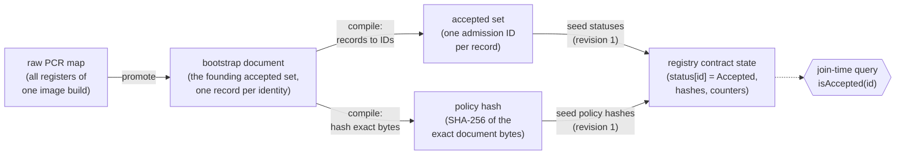
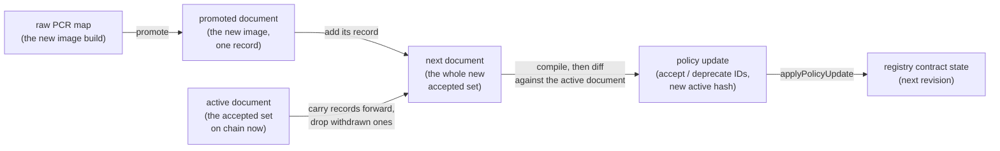

# Measurement-admission specification

Normative rules for Seismic's measurement-admission predicate:

```text
verified guest measurements -> canonical admission ID -> accepted-ID set
```

This document defines how a verified TEE guest becomes one `bytes32`
admission ID (section 5), how a measurement-policy document becomes both the
exact set of accepted IDs and one policy hash (sections 4 and 6), how those
seed `MeasurementRegistry` genesis storage (section 8), and how the accepted
set changes across policy revisions (sections 9 and 10). Sections 11 to 13
cover what each consumer owes the predicate, the golden vectors, and what is
frozen.

Requirement words (MUST, MUST NOT, MAY) apply to any implementation of this
predicate, in any language. Section 3 defines the one schema v1 specifies,
for Azure TDX guests; every other section holds for any schema, because a
second attestation backend adds a schema name and an ID space and leaves the
ID structure, the document format, the registry, and the revision lifecycle
untouched. The reference implementation is this crate.

Every hex value quoted below is a golden vector taken from
[`fixtures/golden/`](fixtures/golden/). `tests/spec_vectors.rs` recomputes
each one from the fixtures and fails if this document and the implementation
disagree.

What conforms today, and where each requirement lands:

| Role | Implementation | Sections |
| --- | --- | --- |
| compiler, admission-ID derivation, genesis-storage derivation | this crate, as a library and as the `seismic-measurement-admission` CLI | 4-8 |
| registry contract | [`MeasurementRegistry.sol`](https://github.com/SeismicSystems/seismic/blob/main/contracts/src/enclave/MeasurementRegistry.sol) in the Seismic repository | 8, 9 |
| responder admission at join time | [`bin/attestation-service`](../../bin/attestation-service/src/admission.rs) | 11 |
| registry read path | [`seismic-measurement-registry-client`](../measurement-registry-client/) | 9, 11 |
| deploy tooling: genesis assembly and revision deltas | [`tee/cli`](https://github.com/SeismicSystems/deploy/tree/main/tee/cli) in the deploy repository | 8, 10 |

A second implementation of any row — in another language, or for another
network's tooling — conforms by satisfying the same sections.

## 1. Terminology

| Term | Meaning |
| --- | --- |
| register | One vTPM PCR: an index 0-23 and a SHA-256 digest. |
| tuple | The register values a schema binds, in schema order. For Azure TDX v1: `(pcr4, pcr9, pcr11)`. |
| guest identity | One tuple. Every machine that boots the same measured image observes the same tuple. |
| schema | A named register set plus the rule that turns its tuple into an admission ID (section 5). The schema name is domain-separated into every ID it produces. |
| admission ID | `bytes32` key of one guest identity: `keccak256(abi.encode(schemaId, <tuple>))`. |
| record | One entry of a policy document: an audit label, an attestation type, and one register map. |
| document | One complete accepted set, as a JSON array of records. The only human-authored format in the pipeline, and the unit a revision publishes. |
| accepted set | The admission IDs a document admits, or the IDs the registry currently holds as `Accepted`. |
| status | Per-ID registry state: `Unknown = 0`, `Accepted = 1`, `Deprecated = 2`. |
| revision | The registry's `policyRevision` counter. Genesis is revision 1; each applied update adds 1. |
| authority | The one address the registry accepts policy updates from: `0x1000000000000000000000000000000000000002`. |

The registry lives at `0x1000000000000000000000000000000000000001`. Both
addresses are genesis predeploys and never change.

## 2. Pipeline

Boxes are artifacts; solid arrows are the steps that produce them. The
dashed arrow is a read: it consumes an artifact without producing one.

### 2.1 Founding



One compile produces both outputs, and they never meet again. The accepted
set decides admission and keys chain state, under keccak-256. The policy
hash records which document a revision authorized, under SHA-256, and no
admission decision reads it. Sections 5 and 6 define them separately for
that reason.

### 2.2 Revision

Admitting one more image starts the same way — measure it, promote it — and
the promoted one-record document is then authored into the next complete
document beside the records already accepted.



Authoring the next document is a set edit: add a record to admit an
identity, drop a record to withdraw one, or both in one revision. There is
no in-place update, because a record's identity is its tuple — changing a
measured value is a different identity, so it is a drop plus an add.
Editing only a `measurement_id` changes the document's bytes and its hash
but not its accepted set, and section 9's `EmptyUpdate` rule rejects a
revision that moves no ID. A label fix therefore lands alongside the next
change to the accepted set, and until then `activePolicyHash` names the
bytes that authorized the set on chain.

The raw PCR map is audit material. The document is what governance reviews
and what the network manifest hash-commits to. The compiled report is a
deterministic machine artifact: implementations regenerate it from the
document on demand rather than author it, and nothing commits to it but the
golden vectors of section 12.

## 3. Azure TDX v1 schema

```text
schema name: seismic.azure-tdx.pcr4-pcr9-pcr11.v1
attestation type: azure-tdx
fields: pcr4: bytes32, pcr9: bytes32, pcr11: bytes32   (preimage order)
schema ID: keccak256(schema name)
         = 0x3638c716e69d8604498bdfc48902b7a798c977e5b6e2cf74586e6d609bb09684
```

The three registers are the ones a Seismic release moves:

| Register | Covers |
| --- | --- |
| pcr4 | The boot manager and the EFI application it loads: the UKI binary identity. |
| pcr9 | Files loaded through the LOAD_FILE2 protocol: the kernel command line and the initrd actually used. |
| pcr11 | The UKI sections measured by systemd-stub. The rootfs is the UKI's `.initrd`, so pcr11 covers the running filesystem. |

Registers outside the tuple MUST NOT contribute to identity under this
schema. The
[Azure guest-measurement review](https://github.com/SeismicSystems/seismic-images/blob/seismic/docs/azure-measurements.md)
is the empirical basis for that register set: the observed 24-register
inventory, the event log behind each schema register, the cross-node
captures, and why each remaining register stays out.

A different register set or attestation backend MUST get a new schema name,
and therefore a disjoint admission-ID space. An implementation MUST NOT
reinterpret v1. Adding SecureBoot coverage, for example, means
`seismic.azure-tdx.pcr4-pcr7-pcr9-pcr11.v2`. Because the registry stores
opaque IDs, a new schema costs new IDs and one policy revision. It never
costs a contract change.

## 4. Policy document

The document is a record list in the format Seismic's attestation stack
parses. [`seismic-attestation`](../attestation/), which wraps the Flashbots
attestation library for quote verification and measurement matching, loads
it as a `SeismicMeasurementPolicy`. One published file therefore serves both
readers: this compiler, which turns the document into chain state, and
`verify_evidence_with_policy`, which SDK clients and operator tooling use to
appraise a node directly. A conforming document is a JSON array of one or
more records:

```json
[
  {
    "attestation_type": "azure-tdx",
    "measurement_id": "seismic-dev_2026-07-02.5c3b5e.vhd",
    "measurements": {
      "pcr4":  { "expected_any": ["d57063c0669599b885c43a0683436a3463ad49513ddb3996e6fc96040508fd8e"] },
      "pcr9":  { "expected_any": ["3f761a6383e09d62ac10ecfea95c27e30de69176337243e7e594714d27f6ac45"] },
      "pcr11": { "expected_any": ["73f2825b7985f9d04eccb3c538793e51617d0d4560c63517d09233114fdd6b18"] }
    }
  },
  ...
]
```

Semantics:

- records are ORed: a guest is admitted if it matches any record;
- registers within one record are ANDed: a guest MUST match every register
  the record binds;
- each register binds exactly one value, so one record is one guest
  identity and compiles to exactly one admission ID.

The third rule restricts the Flashbots format, whose per-register value list
would otherwise admit the Cartesian product of a record's lists. A set of
accepted identities is authored as one record per identity, so the reviewed
document literally lists the accepted set, with no expansion step between
the document and chain state.

Several records are the normal case during a rollout: the network admits the
outgoing and the incoming image at once, and a later revision narrows the set
once every node has moved. Section 10 walks that sequence.

A document is a snapshot, not a log. Every revision publishes a whole
document listing that revision's entire accepted set, so a reader recovers
the policy from one file without replaying earlier changes. Adding or
withdrawing an image means publishing the new complete list, which section 9
carries as one hash rather than a delta. Two revisions MAY publish identical
bytes: reinstating an earlier accepted set republishes that document and
reuses its hash.

### 4.1 Register keys and values

A register key is a bare index (`"4"`) or a `pcr` prefix in any case
(`"pcr4"`, `"PCR4"`), for an index 0-23. Keys normalize to the index, so
`"4"` and `"pcr4"` name the same register.

A register value is exactly 64 hexadecimal characters, case-insensitive,
with no `0x` prefix. A value binds through `expected_any` with one element,
or through the deprecated scalar `expected`.

Normalization unifies IDs, not bytes: two documents that differ only in key
spelling or value case compile to the same accepted set, and still hash
differently, because the hash covers the exact bytes (section 6).

### 4.2 A compiler MUST reject

| Condition | Error |
| --- | --- |
| Not a JSON record list, or a record with an unknown field | `Json` |
| Zero records | `Empty` |
| `attestation_type` other than `azure-tdx` | `UnsupportedAttestationType` |
| Two records with the same `measurement_id` | `DuplicateMeasurementId` |
| A key that is not a PCR index 0-23 | `BadRegisterKey` |
| Two keys that normalize to one index | `DuplicateRegister` |
| A register outside the schema tuple | `UnexpectedRegister` |
| A schema register absent from the record | `MissingRegister` |
| Both `expected` and `expected_any` on one register | `BothExpectedForms` |
| Neither form on one register | `NoExpectedValue` |
| An `expected_any` list whose length is not 1 | `SingleValueRequired` |
| A value that is not 32 bytes of bare hex | `BadValue` |

A record without `measurements` is the permissive format's accept-anything
form. It MUST fail as a missing field. An admission policy has no wildcard
record.

The document seeds chain state, so a compiler MUST be exact where a runtime
matcher may be permissive. Every document this compiler accepts MUST admit
the same guests as `seismic-attestation`'s matcher reading the same file;
`tests/attested_tls_parity.rs` holds that equality. A document that the two
readers appraise differently would admit a node to the network that a client
refuses to trust.

`measurement_id` is audit metadata. It MUST NOT contribute to any admission
ID. Two records with different labels and identical tuples are legal, and
they compile to one ID.

## 5. Admission ID

```text
schemaId = keccak256("seismic.azure-tdx.pcr4-pcr9-pcr11.v1")

preimage = abi.encode(schemaId, pcr4, pcr9, pcr11)
         = schemaId || pcr4 || pcr9 || pcr11        (4 static words, 128 bytes)

admissionId = keccak256(preimage)
```

All four fields are 32-byte words, so the ABI encoding is their
concatenation. Worked example, image A of the golden fixture:

```text
schemaId = 0x3638c716e69d8604498bdfc48902b7a798c977e5b6e2cf74586e6d609bb09684
pcr4     = 0xd57063c0669599b885c43a0683436a3463ad49513ddb3996e6fc96040508fd8e
pcr9     = 0x3f761a6383e09d62ac10ecfea95c27e30de69176337243e7e594714d27f6ac45
pcr11    = 0x73f2825b7985f9d04eccb3c538793e51617d0d4560c63517d09233114fdd6b18

admissionId = 0xa010094f9c414c4acf409cace507908b032ea874a6eb85b3cb592cb79852c39f
```

Image A's values are measured from a devtools-profile dev image build. Image
B uses synthetic values (`0x4a4a...`, `0x9a9a...`, `0x1a1a...`), so the second
identity is unmistakable in test output. Neither document is a production
network's policy.

Rules for deriving an ID from evidence:

- an implementation MUST extract the tuple from measurements that
  cryptographic verification already authenticated;
- a bank missing any schema register MUST fail closed. A partial tuple is
  not an identity;
- registers outside the schema MUST be ignored;
- keccak-256 is the only hash in the ID path, because the ID keys Solidity
  mapping storage. SHA-256 covers documents and transcripts, which never key
  chain state.

## 6. Policy hash

```text
policyHash = SHA-256(exact document bytes)
```

The hash covers the bytes as published: no re-serialization, no
canonicalization, no whitespace repair. An implementation that holds a
promoted document MUST pass it through byte-verbatim, because the network
manifest and the registry both commit to those bytes.

The hash is audit metadata. It proves which document a revision authorized.
It is never consulted by an admission decision.

Golden vectors:

| Document | Records | policyHash |
| --- | --- | --- |
| `measurement-policy-v1.image-a.json` | A | `0x98ba9f24c6d8bc18e8ddb7bb4abea483b2365e58586b94ba4249a0a58f683882` |
| `measurement-policy-v1.json` | A, B | `0xcb3b7821868f37653ed707a637bd2e20b1cd4b8f82e025de998a19812ac24265` |
| `measurement-policy-v1.image-b.json` | B | `0xeda04529c05d8c3581bf47dee76e155bc74585bf96ad0e8b176b3fa570886a0c` |

## 7. Records versus the flattened cross-product

A compiler MUST NOT combine values across records. The two-record fixture
admits exactly two identities:

```text
image A: (d57063c0..., 3f761a63..., 73f2825b...) -> 0xa010094f9c414c4acf409cace507908b032ea874a6eb85b3cb592cb79852c39f
image B: (4a4a4a4a..., 9a9a9a9a..., 1a1a1a1a...) -> 0x87f29d7cea83b1028506f2164761f4794ae0a5f5bb13a0f8e792e8fd1fccaa17
```

A flattening compiler — one that gathered each register's values across the
document and took the product — would admit eight tuples from the same two
records, including six guests that no image ever produces. Two of them:

```text
(A.pcr4, B.pcr9, B.pcr11) -> 0xb92d5c5efc94d20c29b2f9393e782eb4c2ca3900bd626f915792bbcc0aba4e93
(B.pcr4, A.pcr9, A.pcr11) -> 0x4cb2ebe3e5d121dca2c601499a6f37191f0eea704b6ce0d7ff2cc2df3910321d
```

Neither ID is in the accepted set, and neither appears in registry storage.
A guest presenting image A's boot binary with image B's initrd MUST NOT be
admitted. Because each register binds one value, the same protection holds
inside a single record: a record cannot express a product.

An image that genuinely measures into several tuples, such as a transition
image carrying two UKIs, is authored as several records. Its identities stay
enumerated in the document.

## 8. Registry genesis storage

The registry is a genesis predeploy: the runtime bytecode is installed
directly into the account, so no constructor runs. Initial policy state MUST
be written as explicit genesis storage in the EIP-7201 namespace
`seismic.storage.MeasurementRegistry`:

```text
N = keccak256(abi.encode(uint256(keccak256("seismic.storage.MeasurementRegistry")) - 1))
    & ~bytes32(uint256(0xff))
  = 0xa3ae60943e4f183142036d77b94858085814dd428f131289aea7e42703fb0b00

statuses[id]        = keccak256(abi.encode(id, N))
bootstrapPolicyHash = N + 1
activePolicyHash    = N + 2
policyRevision      = N + 3
acceptedCount       = N + 4
```

Genesis values:

```text
bootstrapPolicyHash = policyHash of the bootstrap document
activePolicyHash    = the same hash
policyRevision      = 1                          (0 means uninitialized)
acceptedCount       = number of unique admission IDs
statuses[id]        = 1 (Accepted) for every compiled ID
```

Complete genesis storage for `measurement-policy-v1.json`, as committed in
`measurement-policy-v1.compiled.json`:

| Slot | Value | Field |
| --- | --- | --- |
| `0x...0b01` | `0xcb3b7821868f37653ed707a637bd2e20b1cd4b8f82e025de998a19812ac24265` | `bootstrapPolicyHash` |
| `0x...0b02` | `0xcb3b7821868f37653ed707a637bd2e20b1cd4b8f82e025de998a19812ac24265` | `activePolicyHash` |
| `0x...0b03` | `1` | `policyRevision` |
| `0x...0b04` | `2` | `acceptedCount` |
| `0xc9bd227613139b7d38f8720e88b201789f224276070dce926fb7d30019e638b4` | `1` | `statuses[image A]` |
| `0xc7337a5eeddbfaf538e46562c34392a79810d4d27ebe8dc1150a60c140124770` | `1` | `statuses[image B]` |

`0x...0b0N` abbreviates the namespace base above. The chain never sees a PCR
value or a JSON byte: only keccak keys and status words.

The slot formulas are meaningful only for the contract build they were
frozen against, so a compiled report also carries
`registry_runtime_code_hash`
(`0xd6408a266c8582a56d8583bb56e19fde931f318402f7092a01c6dadf24ae4fe4`),
which is keccak256 of the canonical runtime bytecode in
[`contracts/artifacts/MeasurementRegistry.json`](https://github.com/SeismicSystems/seismic/blob/main/contracts/artifacts/MeasurementRegistry.json).

Deploy tooling MUST prove genesis consistency before a network founds:

1. recompute the document's SHA-256;
2. compile the document to its unique ID set;
3. recompute every status slot;
4. check the registry account against the canonical runtime bytecode;
5. check the policy-hash, revision, and count slots;
6. check that the registry account holds no other storage entry.

The genesis hash then commits to the registry runtime, the initial accepted
IDs, the bootstrap document hash, and the counters. There is no
empty-policy window, and no privileged transaction at t=0.

## 9. Registry behavior

Read path:

```solidity
function isAccepted(bytes32 admissionId) external view returns (bool);
function statusOf(bytes32 admissionId) external view returns (Status);
```

`isAccepted` is the sole admission source. It is O(1) and never enumerates.
The `statuses` mapping is the source of truth. The hashes, revision, and
count support audit and update sequencing only.

Mutation:

```solidity
function applyPolicyUpdate(
    bytes32[] calldata accept,
    bytes32[] calldata deprecate,
    bytes32 newActivePolicyHash
) external;
```

The registry MUST enforce, and reverts otherwise:

| Rule | Revert |
| --- | --- |
| `msg.sender` is the fixed authority address | `Unauthorized` |
| the registry is initialized, so `policyRevision != 0` | `Uninitialized` |
| the update changes something | `EmptyUpdate` |
| `newActivePolicyHash` differs from the current `activePolicyHash` | `UnchangedPolicyHash` |
| no ID repeats within `accept` or within `deprecate` | `DuplicateAdmissionId` |
| no ID appears in both arrays | `ContradictoryAdmissionId` |
| every accepted ID is currently `Unknown` or `Deprecated` | `InvalidTransition` |
| every deprecated ID is currently `Accepted` | `InvalidTransition` |

An update MUST be atomic: every status, the revision, the count, and the
active hash move together, or the transaction reverts and nothing moves.
`policyRevision` increases by exactly 1. `acceptedCount` MUST equal the number of `Accepted`
IDs afterwards. The registry emits one `AdmissionStatusChanged` per changed
ID, then one `PolicyUpdated`.

`Accepted -> Accepted` and `Deprecated -> Deprecated` are invalid, so an
update states a real change. A status MUST NOT return to `Unknown`:
`Deprecated` is a permanent record that an identity was once admitted.

`newActivePolicyHash` MUST be the hash of the complete new document, not of
a delta. A complete document per revision lets an auditor recover the policy
for any revision from one published file, without replaying earlier updates.

The registry does not check that a delta matches a hash. The authority
attests to that relationship. The registry's duplicate, contradiction,
no-op, and transition rules are the atomic backstop for a mis-computed
delta.

The registry recognizes one fixed authority address, and no EOA can occupy
it, so every network installs a forwarding contract there at genesis.
Which contract that is — an audited multisig, a governance adapter, or the
owner-gated development forwarder — is network configuration. It MUST NOT
change the registry, its address, or its storage layout.

## 10. Revision lifecycle

Authority tooling derives the delta from two compiled documents:

```text
accept              = ids(new) - ids(old)
deprecate           = ids(old) - ids(new)
newActivePolicyHash = policyHash(new)
```

Genesis is the degenerate case: no previous document, so the whole compiled
set is written into storage as revision 1.

Worked example over the golden documents. Image A ships first, image B
joins, image A is withdrawn, image A returns:

| Revision | Document | accept | deprecate | Accepted set | `acceptedCount` | `activePolicyHash` |
| --- | --- | --- | --- | --- | --- | --- |
| 1 (genesis) | `measurement-policy-v1.image-a.json` | - | - | A | 1 | `0x98ba9f24...` |
| 2 | `measurement-policy-v1.json` | B | - | A, B | 2 | `0xcb3b7821...` |
| 3 | `measurement-policy-v1.image-b.json` | - | A | B | 1 | `0xeda04529...` |
| 4 | `measurement-policy-v1.json` | A | - | A, B | 2 | `0xcb3b7821...` |

The invariant each revision MUST satisfy: registry state equals the
compiled document. For every ID, `isAccepted(id)` is true exactly when the
ID is in `compile(document).admission_ids`, `acceptedCount` equals that
set's size, and `activePolicyHash` equals the document's hash.

Notes on the example:

- Revision 3 deprecates image A. A node running image A stops being
  admitted at the next join, with no node or service restart.
- Revision 4 reinstates image A through `accept`, because
  `Deprecated -> Accepted` is a valid transition. Reinstatement needs no
  special case.
- Revision 4 republishes revision 2's document, so it reuses that hash. The
  `UnchangedPolicyHash` rule compares against the current active hash only,
  so returning to an earlier document is allowed.
- `bootstrapPolicyHash` stays `0x98ba9f24...` through every revision. It
  records what the network founded on.

`tests/reth_registry.rs` runs exactly this sequence against a real
`seismic-reth` node, through the authority, over `eth_call` and signed
transactions.

## 11. Consumer obligations

This specification governs the responder's appraisal of a joining node:

```text
responder: measurements -> admissionId -> isAccepted() on local reth
```

A responder MUST:

- verify the evidence chain, its freshness, the attestation type, and the
  transcript binding first;
- derive the ID from the verified measurements, and fail closed on a
  missing register;
- read `isAccepted(admissionId)` from the registry address in the network
  manifest, on local chain state;
- authorize the join only when that call succeeds and returns true;
- check that local chain state is this network's chain: block 0 MUST hash to
  the manifest's `eth.genesis_hash`, on every decision. The genesis file is
  host-supplied and the responder is the only party able to appraise it at
  decision time; the pin is what makes the read an appraisal against the
  accepted set that `network_id` commits to, rather than against whatever
  policy the local node was booted with;
- treat local chain state as policy only while it satisfies the readiness
  and freshness gate. A stale or eclipsed node MUST NOT admit a peer,
  because emergency deprecation must not be bypassable;
- never reach a permissive test verifier. Cryptographic verification and
  registry appraisal are one operation, and there is no public path that
  verifies evidence but skips policy.

The joiner's appraisal of the responder is outside this specification. A
joiner cannot read the chain before it holds the root key, so it has no live
accepted set to test against, and a manifest-pinned one would be frozen at
founding. Its defense is provenance — verifying the responder against the
network's pinned `tx_io_pk` commitment — rather than a measurement policy, so
no admission ID is derived on that side.

Should a joiner-side measurement appraisal ever be built, it MUST compile the
bootstrap document with this same compiler and test membership of the
responder's ID in the resulting set. It MUST NOT match registers one by one
against the document: a register-by-register matcher enforces whatever the
document lists, and would disagree with the responder as soon as the two
differ.

Because the ID is derived from exactly the schema registers, a promoted
document carries exactly those. Release tooling checks the remaining
registers against the expected 24-register inventory at image-build time,
where a mismatch fails a build instead of a join.

## 12. Golden vectors and conformance

`fixtures/golden/` pins the whole pipeline. Any implementation of this
specification can assert the same files.

| File | Role |
| --- | --- |
| `make-measure-output.image-a.json` | Raw measured-boot output for image A, with non-schema registers and the event log. |
| `measurement-policy-v1.image-a.json` | The image-A-only document, promoted from the raw output above: revision 1. |
| `measurement-policy-v1.json` | The two-record document: images A and B. |
| `measurement-policy-v1.compiled.json` | Its compiled report: hashes, IDs, per-record IDs, runtime code hash, complete genesis storage. |
| `measurement-policy-v1.image-b.json` | The image-B-only document: revision 3. |
| `measurement-policy-v1.image-b.compiled.json` | Its compiled report. |

A compiled report is deterministic: fixed field order, sorted maps,
2-space JSON, one trailing newline. A deliberate change to any rule this
document states means regenerating the reports in the same change.

| Test | Holds |
| --- | --- |
| `src/lib.rs` unit tests | Schema ID, one admission-ID vector, fail-closed extraction. |
| `src/policy.rs` unit tests | Every rejection above, key and value normalization, no cross-record flattening. |
| `src/genesis.rs` unit tests | The EIP-7201 base against its defining expression, field offsets, one status-slot vector shared with Solidity. |
| `tests/golden.rs` | The fixtures compile and promote to the committed bytes. |
| `tests/spec_vectors.rs` | Every value in this document matches the fixtures. |
| `tests/attested_tls_parity.rs` | Accepted semantics equal the permissive matcher's. |
| `tests/registry_abi.rs` | The Rust interface matches the canonical contract ABI. |
| `tests/fixture_parity.rs` | The Seismic repository's fixture copies are byte-identical. |
| `tests/reth_registry.rs` | Genesis policy and the revision lifecycle on a real node. |
| [`MeasurementRegistry.t.sol`](https://github.com/SeismicSystems/seismic/blob/main/contracts/test/MeasurementRegistry.t.sol) | Registry rules, slot vectors, and the compiled fixture loaded as genesis storage. |

## 13. Change control

Frozen for schema v1. A change breaks every deployed network's policy:

- the schema name, its register set, and their preimage order;
- the admission-ID preimage and hash function;
- the EIP-7201 namespace string, the field offsets, and the status-slot
  formula;
- the status values, and the genesis revision number 1.

Extensible without touching any of the above:

- a new attestation backend or register set, as a new schema name with its
  own ID space;
- a new accepted set, as a policy revision;
- the authority implementation behind the fixed authority address;
- an on-chain catalog that publishes admission preimages, which can prove
  `keccak256(preimage) == admissionId` for an already-authoritative ID
  without joining the admission path.
